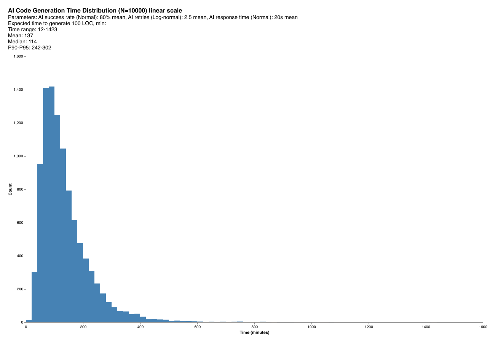
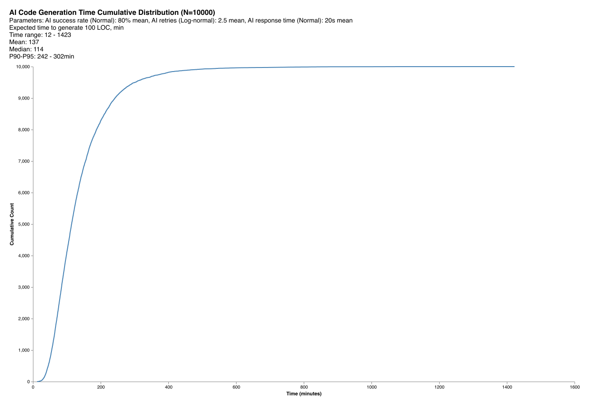

# AI Coding Time Monte Carlo Simulator

The script simulates expected time for AI coding agent to generate code. It visualizes time distribution. You can use it for realistic estimation how much time you will spend coding with AI.

This project itself took about 8 hours. ChatGPT (paid plus subscription) designed formula for simulation, and Cursor (paid 20$) subscription wrote code.

As you can see, the simulation well confirms results obtained in the experiment itself. It took 8 hours to create 400 LOC you see in sim.ts script. 

The simulation shows expected time for 100 LOC is 132 min (2 hours), see plots below.

These are the values I've used for simulation.

20 seconds is reasonable assumption for Cursor response with 0.05 deviation (it actually was larger values). log-normal distribution well describes how AI gets "stuck" if unable to generate correct response within first attempts.

Definitely change these params where `CodingTimeSimulator` class instantiated and see how it affects expected value.

```
0.9 with 0.5 Std
Mean (μ) of log-normal AI retries. How many retries AI makes before success.

20 sec with 3 Std
Mean (W) AI task generation time. Base time AI takes per attempt.

0.05
Multiplicative retry delay (α). Increases slowdown per retry.

1 
Retry scaling exponent (p). Controls how retry impact grows.

100 
Task size (LOC). Number of lines AI is generating.

0.8 with 0.05 Std
Mean AI success rate (R). Fraction of code AI gets right per attempt.
```

$$
T_{\text{AI}} = W \cdot N \cdot (1 + \alpha N^p) \cdot \frac{\text{LOC}}{R \cdot 60}
$$

 **Where:**
**Where:**
- $W$ : Wait Time Mean — Base AI response time per attempt (normally distributed)
- $N$ : Retry Count — Log-normally distributed number of retries before success
- $\alpha$ : Retry Impact — Per-retry delay multiplier
- $p$ : Retry Power — Exponent controlling retry slowdown growth
- $\text{LOC}$ : Lines of Code — Task size being generated
- $R$ : Readiness — AI effectiveness (normally distributed)

## Requirements

- Node.js >= 16
- yarn

## Installation

```bash
yarn install
```

## Usage

Run simulation with default parameters:
```bash
yarn ts-node sim.ts
```

### Parameters

- `mu` (0.9): Log-normal mean of retry count
- `sigma` (0.5): Log-normal std dev of retries
- `readinessMean` (0.8): AI success rate mean (80%)
- `waitTimeMean` (20): AI response time mean in seconds
- `retryImpact` (0.05): Slowdown per retry
- `linesOfCode` (100): Task size in LOC

### Output

Generates 2 plots:
- Distribution histogram (log scale)
- Cumulative distribution (log scale)

File naming: `sim_r{readiness}_w{wait}_mu{mu}_s{sigma}_i{impact}_p{power}_{scale}.png`

## Example Results

Below are example simulation results with default parameters (N=1000):

### Time Distribution (Log Scale)


The histogram shows right-skewed distribution of AI coding times
- It completes generation within 50-200 minutes
- Long tail extends to ~800 minutes (AI gets "stuck")
- Peak around 100-150 minutes matches median time
- Log scale reveals the exponential nature of delays in retry (if it can't complete within few retries, you better step in and do some coding)

### Cumulative Distribution (Log Scale)


The S-curve shows cumulative probability of generating 100 LOC:
- 50% chance it completes under 116 minutes (median)
- 90% chance it complete under 240 minutes
- 95% chance it completes under 300 minutes
- Steep middle section (80-200 min) indicates typical completion range
- There is a lot tail of of longer times